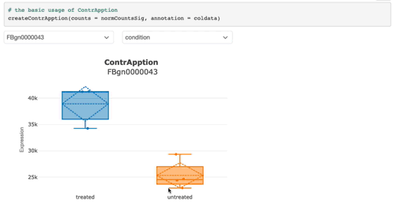

# ContrApption

ContrApption interactively visualizes RNA-Seq style datasets from a single function call, using HTML to create sharable documents without the need to write or host a Shiny app. ContrApption interacts with other widgets using [crosstalk]().

## Modes

There are three widgets currently supported.

### Counts Boxplot

The most basic usage of `ContrApption` is to visualize counts in a boxplot.



### Counts Table and Boxplot

`ContrApption` is compatible with [DT](https://rstudio.github.io/DT/) via [crosstalk](https://rstudio.github.io/crosstalk/), allowing useres to interact with their datasest across a table and the boxplot.


### Differential Expression Table and Boxplot

`ContrApption` can also create widgets that allow for comparison of the result of tests for differential expression to be explored and visualized in the boxplot.


## Installation

```R
devtools::install_github("omics-kitchen/ContrApption")
```

## Misc

### Git workflow

  - dev: Working branch. New features are developed here.
  - staging: Finished work from dev or a feature branch. Test in context here.
  - master: Working, production branch.